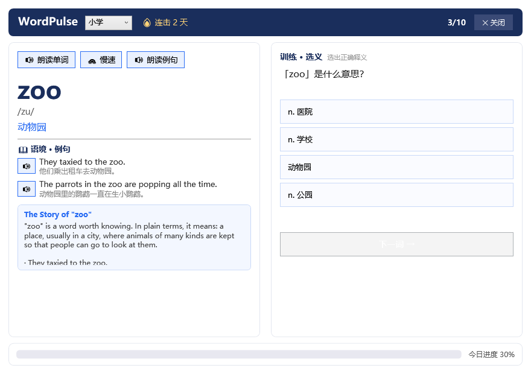

# WordPulse 单词学习窗


开机自动弹出的英语单词学习窗口：每天登录 Windows 自动弹窗，用 **语境 + 朗读 + 文章 + 训练** 四模块帮你对抗"学了就忘"。

## 项目预览

主界面：左侧词卡（单词/音标/释义/双语例句/语境文章），右侧训练区（选义/拼写/填空轮换），顶部级别切换与连击打卡，底部当日进度。



## 一、核心功能

| 模块 | 作用 |
|------|------|
| 📖 语境 | 每个词配 2-3 个中英对照例句，**每条例句旁有 🔊 喇叭，点击即朗读** |
| 🔊 朗读 | Windows 自带 TTS 朗读单词与例句，支持常速/慢速 |
| 📄 文章 | 每个词有一篇完整语境文章；**点击文章标题进入独立阅读界面**，每词可点词朗读、每句可点喇叭 |
| ✍️ 训练 | 选义 / 拼写 / 填空三种题型轮换，答对答错即时反馈；**答错的词按规律隔词重排反复巩固，直到答对**；全部输入（含错误）落盘记录 |

**记忆机制（SM-2 间隔重复）**：答对的词按 1 → 3 → 7 → 15 → 30 天间隔逐步拉长复习周期；答错的词重置为 1 天、计入 lapses。答错的词第二天自动回到复习队列。

**每日打卡**：连续学习天数（streak）自动累计；每天首次弹窗，当日任务学完显示完成页——可点「**再学 10 个**」继续加学，或「**重新学习**」巩固今日词汇，或 ✕ 关闭；未学完则 30 分钟后补弹一次（不打扰、不遗漏）；打开后 10 分钟无操作自动关闭。

**学习记录自动保存**：每次答题实时保存为 Markdown 文档（`<记录目录>\每日英语学习\<日期>.md`），包含当日单词+语境文章、训练题目与正误、全部输入明细（含错误），学习记录自动留存、不丢进度。记录默认保存在**项目内 `data\notes\English\每日英语学习\`**，零外部依赖；如需写入 Obsidian 库，可在 `data\config.json` 中配置 `obsidianEnglishDir`（可选）。

## 二、部署方式（全部相对路径，整体可迁移）

本项目**不使用绝对路径**：所有脚本路径均基于脚本自身位置（`$PSScriptRoot`）相对推导，**整个项目文件夹可整体拷贝迁移**，无需修改任何脚本。

学习记录默认保存在项目内 `data\notes\English\每日英语学习\`，**开箱即用、零外部依赖**。可选配置集中在 `data\config.json`（首次运行自动生成）：

```json
{
  "obsidianEnglishDir": "",
  "desktopDir": "",
  "maxReviewPerDay": 20
}
```

| 配置项 | 作用 | 迁移时 |
|--------|------|--------|
| `obsidianEnglishDir` | 留空 = 记录保存到项目内 `data\notes\English`；填写 Obsidian 库目录 = 写入其「每日英语学习」 | 一般留空即可，无需修改 |
| `desktopDir` | 桌面快捷方式目标目录（留空 `""` 自动用系统桌面） | 一般留空即可，无需修改 |
| `maxReviewPerDay` | 每日复习队列封顶（默认 20，`0` = 不限制）；断学几天后到期词自动分摊，不会一天涌爆 | 按需调整 |

> **迁移步骤**：① 整个 `WordPulse` 文件夹拷贝到新机器任意位置 → ② 运行 `tools\install.ps1` 重建快捷方式。完成。学习记录与进度随文件夹一起迁移。

## 三、词库体系

四级渐进词库，全部来自有道开源教材词库（kajweb/dict，GitHub 3.6k⭐），按人教版教材分级：

| 级别 | 来源 | 词数 |
|------|------|------|
| 小学 | 人教版 PEP 三年级~六年级（8 册） | 819 |
| 初中 | 人教版 PEP 七年级~九年级（5 册） | 2,289 |
| 高中 | 人教版 PEP 必修+选修（11 册） | 3,536 |
| 大学 | 大学英语四级 + 六级（CET4/6） | 5,355 |
| **合计** | | **11,999** |

每个词条含：单词、美/英音标、中文释义、英文释义、2-3 条双语例句、常用短语。
**手动加词**：运行 `tools\add-word.ps1 -Word xxx` 可把自定义词加入当前学习级别。

学习顺序：从小学级别开始，每日 10 个新词 + 到期复习词；当前级别全部学完后（可手动切换 `progress.json` 的 `currentLevel` 字段升级到下一级别）。

**全量查询词库**（`data\fullwordbook.tsv`，约 2.4 万常用词条）：独立的**查询专用**词库，不参与背诵队列、不影响四级词库进度。用于**文章阅读窗点词查义**的兜底——文章里的词常是变形（taxied/popping/parrots/went…），查义按"当前级 → 跨级 → 全量词库 → 词形还原"链路解析，尽量让每个点击的词都有释义（含原形与来源标注）。数据源：ECDICT 简明英汉增强版（skywind3000，MIT 协议），重建脚本 `tools\build-full-dict.ps1`。

## 四、快速开始

```powershell
# 1. 安装（创建桌面快捷方式 + 开机自启）
powershell -NoProfile -ExecutionPolicy Bypass -File <项目根>\tools\install.ps1

# 2. 立即学习
powershell -NoProfile -ExecutionPolicy Bypass -File <项目根>\app\wordpulse.ps1
```

> `<项目根>` 指 WordPulse 文件夹所在位置，如 `D:\Tools\WordPulse`。脚本内部全部相对路径，放哪都行。

安装后：
- 桌面出现「WordPulse 单词学习」图标，双击即学
- 下次登录 Windows 自动弹出学习窗
- 学完当日任务显示完成页：可「再学 10 个」继续 / 「重新学习」巩固 / ✕ 关闭；没学完 30 分钟后再弹一次

## 五、目录结构

```
WordPulse\                          # 项目根（整体可迁移）
├── app\
│   └── wordpulse.ps1              # 主程序（WPF 单文件 GUI）
├── core\
│   └── wordpulse-core.ps1         # 核心引擎（词库/SM-2/打卡/记录/配置）
├── data\
│   ├── config.json                # 可选配置（Obsidian 目录/桌面目录，默认留空零依赖）
│   ├── notes\                     # 学习记录（默认保存于此，自动生成）
│   ├── wordbook_*.json            # 四级词库（转换产物，UTF-8 无 BOM）
│   ├── progress.json              # 学习进度（自动生成，原子写入防损坏）
│   ├── backups\                   # 进度每日滚动备份（保留最近 7 份，自动生成）
│   ├── books\                     # 原始 NDJSON（26 册教材词库）
│   └── raw\                       # 原始 zip 包
├── tools\
│   ├── install.ps1                # 安装：桌面 + 自启快捷方式
│   ├── uninstall.ps1              # 卸载：删快捷方式 / -PurgeData 清数据
│   ├── restore-progress.ps1       # 列出进度备份并一键恢复
│   ├── convert-wordbook.ps1       # 词库转换脚本
│   ├── add-word.ps1               # 手动加词
│   ├── make-icon.ps1              # 重新生成专属桌面图标（assets\WordPulse.ico）
│   └── smoke-test.ps1             # 核心引擎冒烟测试
└── assets\
    ├── WordPulse.ico              # 桌面快捷方式专属图标
    └── WordPulse_256.png          # 图标源图（256x256）
```

## 六、数据与进度

- **学习进度**：`data\progress.json`——记录每日学习列表、每词复习状态（level/interval/due/reps/lapses）、连续打卡天数。**每次答题立即落盘**，程序异常退出也不丢进度。
- **学习记录**：每次答题实时写入 `<记录目录>\每日英语学习\<日期>.md`（按日期命名），含今日单词+语境文章、训练记录表（题型/题目/我的答案/正误）、答题明细（我的输入，含错误）。记录目录默认 = 项目内 `data\notes\English`（零外部依赖）；若在 config.json 配置了 `obsidianEnglishDir` 则写入该 Obsidian 库。可直接用任意 Markdown 编辑器（如 Typora、Obsidian）打开复习。
- **主动生成记录**：`progress.json` 的 `dailyLog` 字段按天追加「日期、新词数、复习数、答对/答错明细」，可自行导出做学习分析。
- **完全本地化**：不联网、不上传、不写注册表（安装只创建两个快捷方式）、不装服务、不碰系统目录。

## 七、常用操作

| 想做什么 | 怎么做 |
|----------|--------|
| 立即学习 | 双击桌面「WordPulse 单词学习」 |
| 键盘快捷键 | `1-4` 选答案 / `Enter` 提交或下一词 / `N` 下一词（拼写输入时 Enter 正常提交） |
| 手动加词 | `tools\add-word.ps1 -Word perseverance` |
| 升级级别 | 点窗口顶部「小学/初中/高中/大学」下拉即切，各级进度独立保留、随时切回 |
| 进度备份/恢复 | 启动时自动备份到 `data\backups\`（每日一份，留 7 份）；手动恢复跑 `tools\restore-progress.ps1` |
| 迁移到新机器 | 拷贝整个文件夹 → 改 `data\config.json` → 重跑 install.ps1 |
| 暂停自启 | 删除启动文件夹里的「WordPulse 单词学习.lnk」 |
| 完全卸载 | `tools\uninstall.ps1 -PurgeData`（详见 UNINSTALL.md） |

## 八、常见问题

**Q：弹窗没出现？**
检查启动文件夹 `C:\Users\<用户名>\AppData\Roaming\Microsoft\Windows\Start Menu\Programs\Startup` 下是否有「WordPulse 单词学习.lnk」，没有则重跑 install.ps1。

**Q：TTS 没声音？**
需要系统装有英语语音包。设置 → 时间和语言 → 语言 → 添加"英语(美国)"语音。程序会自动选择英文语音，找不到时退化为系统默认语音。

**Q：想重新学小学级别？**
删除 `data\progress.json`（或备份后删除），重新启动即从头开始。

**Q：词库能不能换？**
可以。重新下载词库 zip 到 `data\raw\`，改 `tools\convert-wordbook.ps1` 的 `$levelMap` 映射后重跑即可。

**Q：学习记录写到了哪里？**
默认保存在项目内 `data\notes\English\每日英语学习\`，打开即可查看。如需写入自己的 Obsidian 库，编辑 `data\config.json` 的 `obsidianEnglishDir` 指向 Obsidian 库 English 目录。
